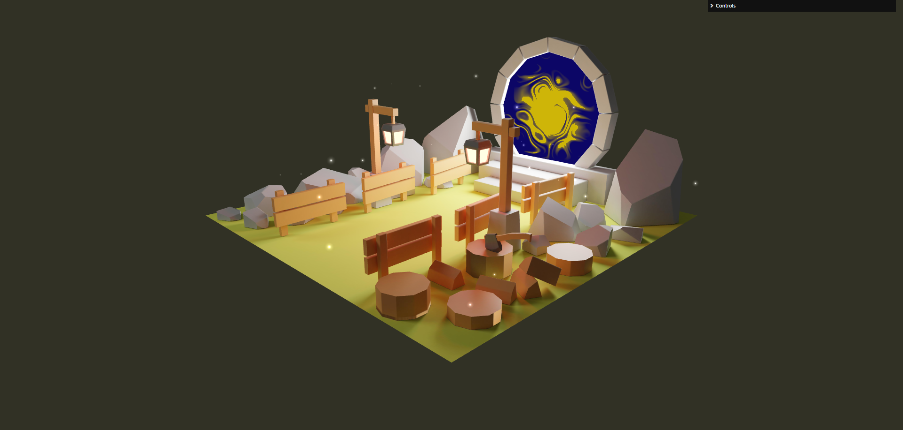

## Little 3D blender scene with Three.js

Ceci est ma première scene 3D crée avec blender. En suivant la formation [Three.js Journey](https://threejs-journey.com/), j’ai créé ce model et baked les textures des différents models. Le glb et les textures baked on était importé dans [three.js](https://threejs.org/). Les lucioles et le portail ont étaient animés avec des shaders GLSL.

## Links

[Live](https://little-3-d-blender-scene.vercel.app/)

[GitHub](https://github.com/Valentin667/little-3D-blender-scene)

## Setup

Download [Node.js].(https://nodejs.org/en/download) Run this followed commands:

```bash
# Install dependencies (only the first time)
npm install

# Run the local server at localhost:8080
npm start

# Build for production in the dist/ directory
npm run build
```

Open [http://localhost:3000](http://localhost:3000) with your browser to see the result.

## Credits

[Three.js journey](https://threejs-journey.com/)


